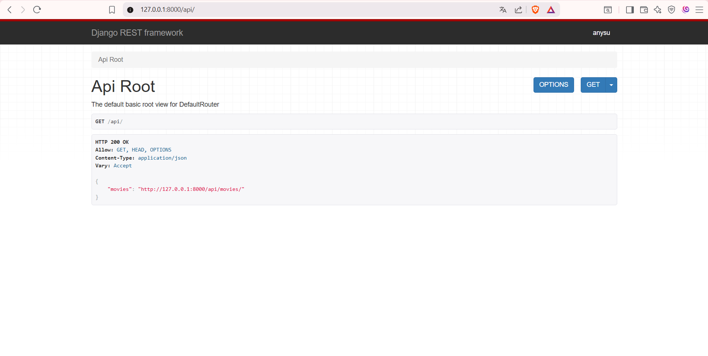
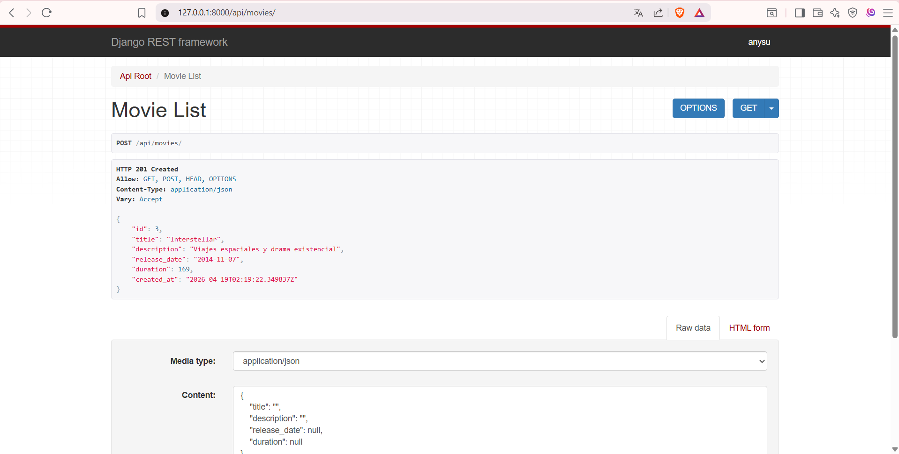
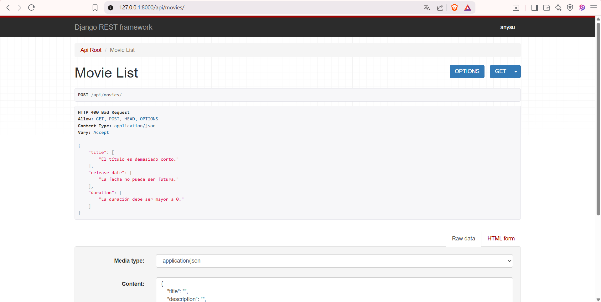

# ⋆｡˚ 𓇼 ˚ Proyecto Cinespoilers API ⋆｡𖦹 ˚｡⋆

---

## ┊ ✩  ┊   ✧   ┊   ┊

## ┊    ┊★      ┊   ✩⋆

## ┊    ┊       ⊹˚


---

## ⋆｡𖦹 ˚ 𓇼 ˚｡⋆ Pasos para ejecutar el proyecto

1. Clonar el repositorio
2. Crear entorno virtual
3. Activar entorno
4. Instalar dependencias
5. Ejecutar migraciones
6. Iniciar servidor

Comandos utilizados:

```
git clone URL_DEL_REPO
cd cinespoilers
python -m venv venv
venv\Scripts\activate
pip install -r requirements.txt
python manage.py migrate
python manage.py runserver
```

---

## ૮ ˶ᵔ ᵕ ᵔ˶ ა EVIDENCIAS DEL FUNCIONAMIENTO

### 📸 API funcionando



### 📸 Creación de película (POST)



### 📸 Validaciones en acción



---

## ˶ˊᜊˋ˶ CRUD COMPLETO

### 📸 Create


### 📸 Read_lista


### 📸 Read_Detalle


### 📸 Update


### 📸 Delete


---

## ✩⋆    ✮  Conclusión

Se logró implementar correctamente una API REST funcional con buenas prácticas básicas, permitiendo la gestión de películas y validación de datos.
